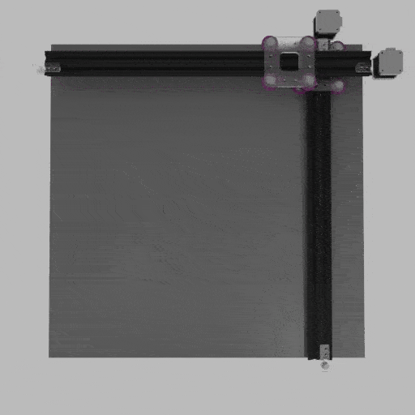

# Plotter project 2022
## Current status: Early Development

## A base structure for any small scale cnc/plotter/printer

### This project is designed as an introduction to use of markerspace tools and machines such as a laser cutter and 3d printer. It also in includes stepper motors and microcontrollers.

This design has been adapted from Superb Tech's 3D printed plotter found [here](https://www.youtube.com/watch?v=WgsTyhX311E)

Non standard aluminium extrusion is used in this project purely because my makerspace has lots of it.
It is 20x40 with an extra flange on top edges. 

---

## Parts
- 20x40 aluminium extrusion - length TBA
- Acrylic sheet 6mmx200x100
- Base board 600x600
- 2x stepper motors
- belts - length TBA
- Arduino UNO, Leonardo, MEGA
- 12v power supply
- V-grove nuts and bolt - TBA  

